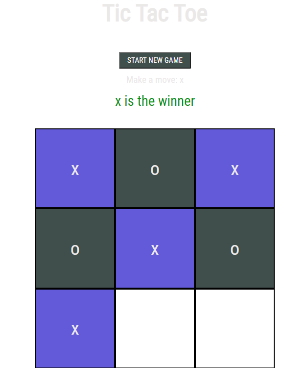

# Project: Tic Tac Toe Testing

It`s a testing of the Tic Tac Toe game, where two players choose a mark and the fill in their respective mark on the 3 by 3 board, a player having three consecutive mark wins the game. If neither player achieves that, then it becomes a draw. This is a simple game with no AI functionality.

The tests are implemented using the Jest testing framework. 

## Built With

- HTML
- CSS
- java script
- ESLint
- Jest
- Babel

## Live Version

[Live Link](https://emmanuelkamala.github.io/ticTacToeTesting/)

## Getting Started

Open your terminal or text editor and use next command

        git clone https://github.com/emmanuelkamala/ticTacToeTesting.git

        cd ticTacToeTesting

After if you want to do any changes please create new branch, after changes open pull request.
Happy coding! 

## Author

👤 **Author**

- Github: [emmanuelkamala](https://github.com/emmanuelkamala)
- Twitter: [ejkamala](https://twitter.com/ejkamala)
- Linkedin: [emmanuelkamala](https://linkedin.com/in/emmanuelkamala)

## 🤝 Contributing

Contributions, issues and feature requests are welcome!

Feel free to check the [issues page](issues/).

## Show your support

Give a ⭐️ if you like this project!

## Acknowledgments

- The odin project
- Microverse tips

## 📝 License

This project is [MIT](lic.url) licensed.